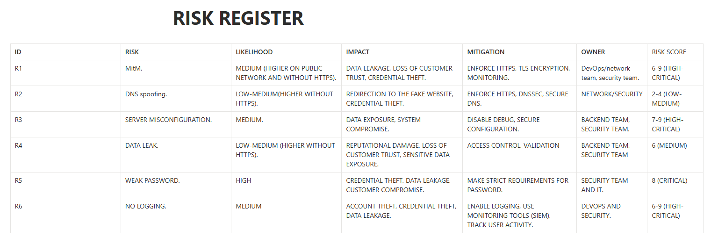

# Case Study: Web Request Lifecycle & Risk Mapping 🌐 🛡️

### Project Overview
As part of my Technical GRC studies, I performed a deep dive into how a single web request travels through the internet and mapped the security risks at each stage.

### The Objective
To bridge the gap between technical network protocols and business risk management by creating a "Risk Register" for a standard web transaction.

### Key Analysis Stages:
1. **DNS Resolution:** Identified risks like DNS Spoofing and Hijacking.
2. **TCP Handshake:** Analyzed SYN flood vulnerabilities.
3. **TLS/SSL Encryption:** Evaluated the importance of certificate validation.
4. **HTTP Request/Response:** Mapped OWASP Top 10 risks (Injection, Broken Access Control).

### Evidence & Documentation
Below is the risk register I developed during this research:

### GRC Outcome
This project demonstrates the ability to perform a **Security Impact Analysis**. By understanding the technical flow, I can recommend specific controls (e.g., HSTS, DNSSEC, WAF) to mitigate business-level risks.

**Project Status:** Verified & Documented ✅
