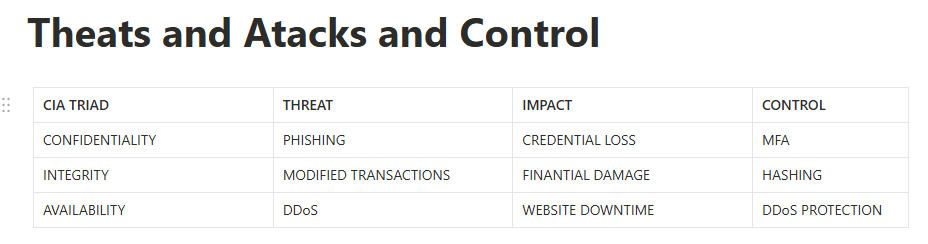

---

 # CIA TRIAD

---

# C - Confidentiality
* Confidentiality ensures that sensitive data can only be accessed by authorized individuals.
   - If confidentiality is not maintained, unauthorized individuals can access the data.
# RISKS:
- FINANTIAL LOST
- PRIVACY VIOLATIONS
- LEGAL CONSEQUENCES

# CONTROLS:
- MFA
- ENCRYPTION
- PERMISSIONS
- HTTP AND TLS

---

# I - Integrity
* Integrity ensures that unauthorized individuals do not modify data.
  - Without integrity data can be altered and no longer be trusted .
  - Unauthorized changes in data can sometimes lead to dangerous consequences.

# CONTROLS
- hashing
- digital signatures
- logging
- access control

 ---

 # A - Availability
 * Availability ensures that data and services are available to authorized users when needed.

# CONTROLS
- backups
- DDoS protection
- redundancy
- monitoring

---

# CIA Triad is not just definitions, it is a security mindset.

