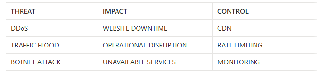

# DDoS and Availability

## Overview

DDoS (Distributed Denial of Service) is an attack that floods a system, server, or website with massive amounts of traffic.

The main goal of a DDoS attack is to make systems unavailable for legitimate users.

DDoS attacks primarily target:

Availability:
- which is one of the three components of the CIA Triad.

---

# DoS vs DDoS
|Attack|Meaning|
|---|---|
|DoS|Attack from one source|
|DDoS|Attack from many systems simultaneously|

---

# What Is a Botnet

Many DDoS attacks use:

- botnets

* A botnet is a network of infected devices controlled by attackers.

* These devices can generate massive traffic against a target.

---

# Availability in Cybersecurity

Availability means that systems and services should remain accessible to users.

If availability is disrupted:

- customers cannot access services;
- operations may stop;
- businesses may lose revenue.

---

# Business Impacts of DDoS
|Consequence|Business Impact|
|---|---|
|website downtime|lost sales|
|unavailable services|customer frustration|
|operational disruption|financial losses|
|service outage|reputational damage|

---

# Scenario Analysis
* Scenario

* An online store receives massive traffic from thousands of IP addresses.

- Customers cannot access the website.

- Sales stop for several hours.

# Threat

# The threat is:

- DDoS attack
- CIA Component Targeted

# The targeted CIA component is:

- Availability:
because legitimate users cannot access the website.

# Business Impact

* Potential business impacts include:

- financial losses;
- operational disruption;
- customer dissatisfaction;
- temporary reputational damage.

Large online stores may lose significant revenue during downtime.

---

# Security Controls
|Control|Purpose|
|---|---|
|CDN|distribute traffic across multiple servers|
|firewalls|filter malicious traffic|
|monitoring|detect attacks|
|redundancy|keep systems online|
|rate limiting|reduce traffic abuse|

---

# What Is CDN

CDN stands for:

- Content Delivery Network

* A CDN distributes traffic across multiple servers located in different regions.

This helps:

- reduce overload on one server;
- improve availability;
- increase resistance against DDoS attacks.
- Security Perspective

* DDoS attacks are not only technical attacks.

* They are business risks because they directly affect:

- availability;
- revenue;
- operations;
- customer trust.
- Conclusion

* Availability is critical for businesses.

When systems become unavailable, organizations may lose:

- money;
- customers;
- operational stability;
- trust.

# DDoS protection is an important part of operational security and business continuity.

---

# Screenshots

