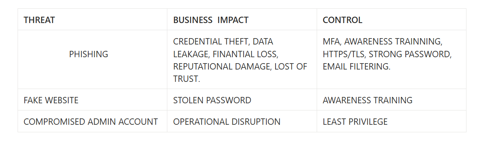

---

# What is phishing?
Phishing is fake communication designed to steal information!

---

# There is 4 types of phishing

# [1] Email Phishing
Fake email
  For example: "Your account was suspended"

---

# [2] Spear Phishing
Targeted phishing against:
- employee
- admin
- company executive

---

# [3] SMS Phishing 
Fake SMS
- banking alerts
- fake verification

---

# [4] Fake Website
Fake login pages
- Google
- Microsoft
- banking sites

---

# Credential Theft 

*stealing usernames and passwords 

What can happens?
- account compromise
- data leakage
- ransomwere deployment
- finantial theft

Business impact!!!

