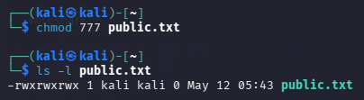
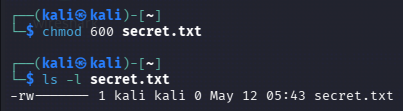

# Linux Permissions and Ownership

## Overview

In Linux, permissions and ownership are important security controls that help protect sensitive files and reduce unauthorized access.

During this lab, I practiced working with:
- chmod
- chown
- Linux permissions
- filesystem exploration
- security risks related to bad permissions

---

# Linux Permissions

Linux permissions are divided into three categories:

| Symbol | Meaning |
|---|---|
| r | Read |
| w | Write |
| x | Execute |

Permissions apply to:
- User (Owner)
- Group
- Others

---

# chmod

`chmod` means:

change mode
Example: chmod 777
chmod 777 public.txt

This gives everyone permission to:

read
write
execute
Security Risk

Using 777 permissions is dangerous because:

anyone can modify files;
malware can abuse permissions;
unauthorized users may access sensitive data.
Example: chmod 600
chmod 600 secret.txt

This allows only the owner to:

read
write

Nobody else has access.

Security Benefit

600 permissions help:

reduce unauthorized access;
protect confidential data;
improve system security.

---

# chown

chown means:

change owner

It changes file ownership.

Example
sudo chown $USER:$USER secret.txt

This changes the owner and group of the file to the current user.

Why Ownership Matters

Incorrect ownership can lead to:

unauthorized access;
privilege misuse;
data exposure.

Ownership is an important access control mechanism in Linux.
